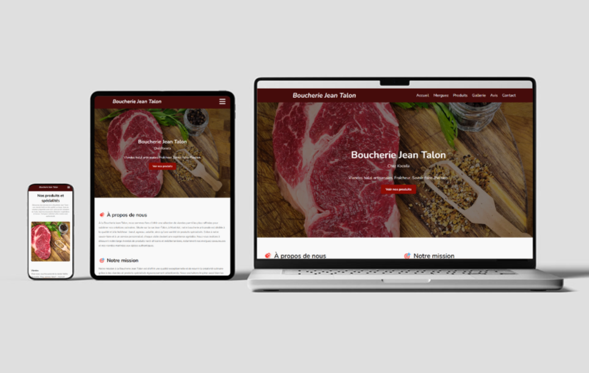

# Boucherie Jean Talon

### Présentation du projet

Ce projet est un site vitrine développé pour la Boucherie Jean Talon. Il met en avant les produits artisanaux de la boucherie — viandes, volailles, fruits, légumes et épicerie maghrébine — dans un design responsive et moderne. Le site reflète l'identité de la maison Chez Koceila, avec une navigation fluide et une présentation claire des spécialités proposées.

### Project Overview

This project is a responsive showcase website built for Boucherie Jean Talon. It highlights the butcher shop’s meat, poultry, fresh produce, and traditional Maghrebi groceries. The design emphasizes authenticity, quality, and the warm identity of Chez Koceila.

